# Diagramas UML - Sistema de Venta de Boletos

Sistema tipo Eventbrite donde organizadores crean eventos y usuarios compran boletos.

---

## 1. Diagrama de Casos de Uso

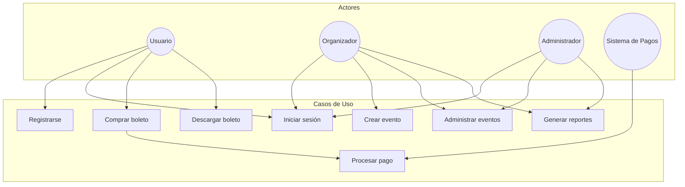

---

## 2. Diagrama de Clases

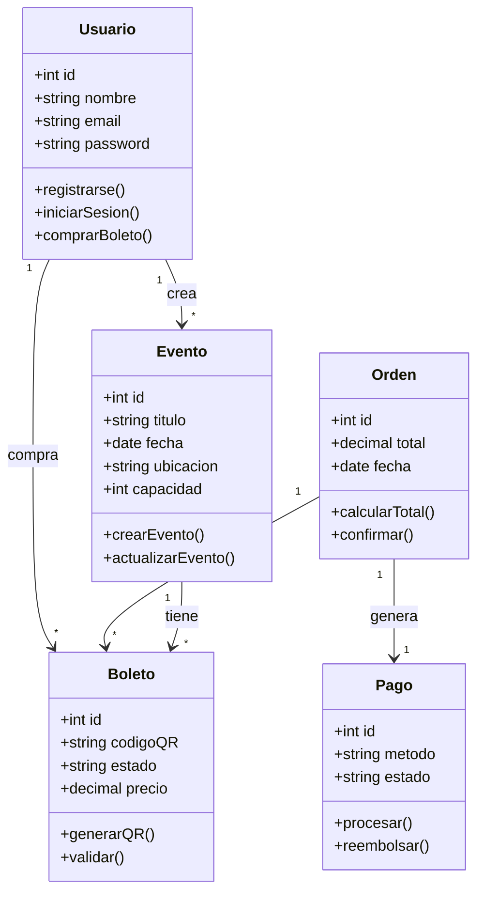

---

## 3. Diagrama de Objetos

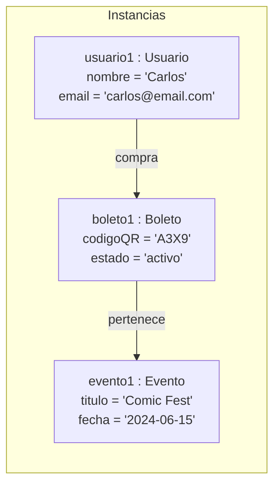

---

## 4. Diagrama de Secuencia

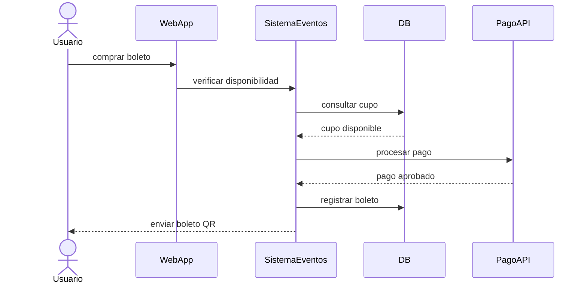

---

## 5. Diagrama de Actividades

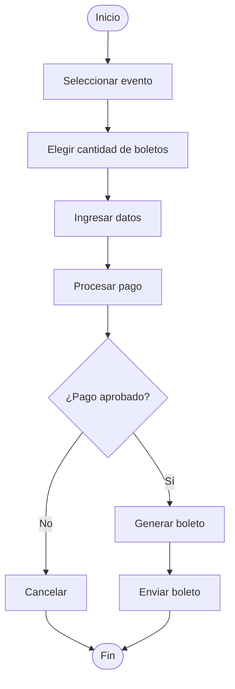

---

## 6. Diagrama de Estados

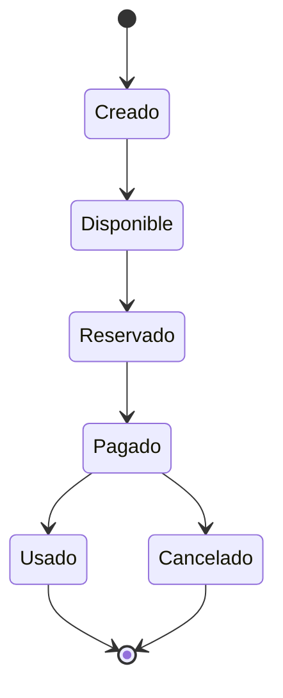

---

## 7. Diagrama de Componentes

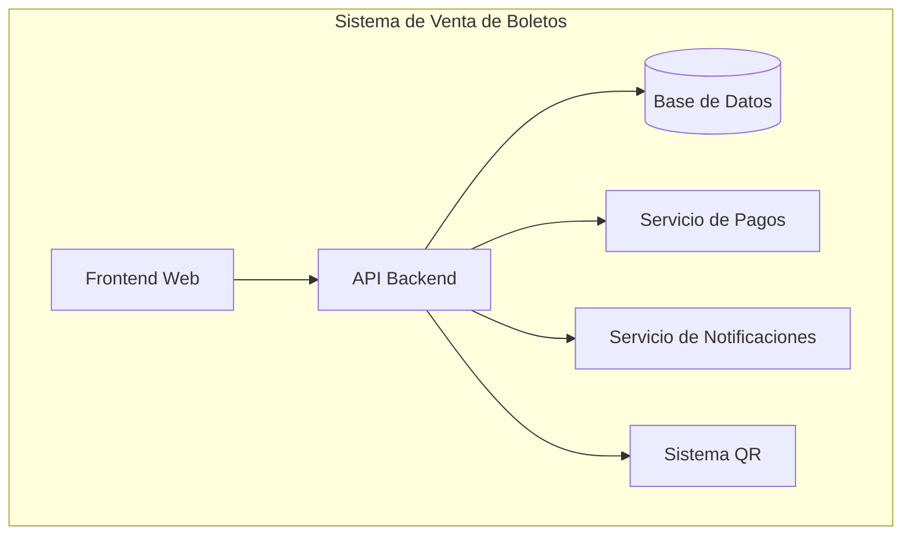

---

## 8. Diagrama de Paquetes

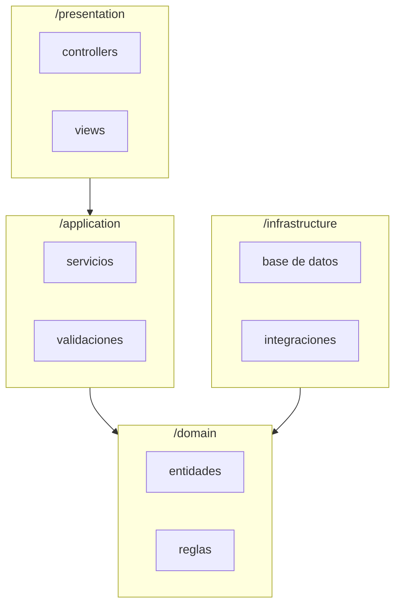

---

## 9. Diagrama de Despliegue

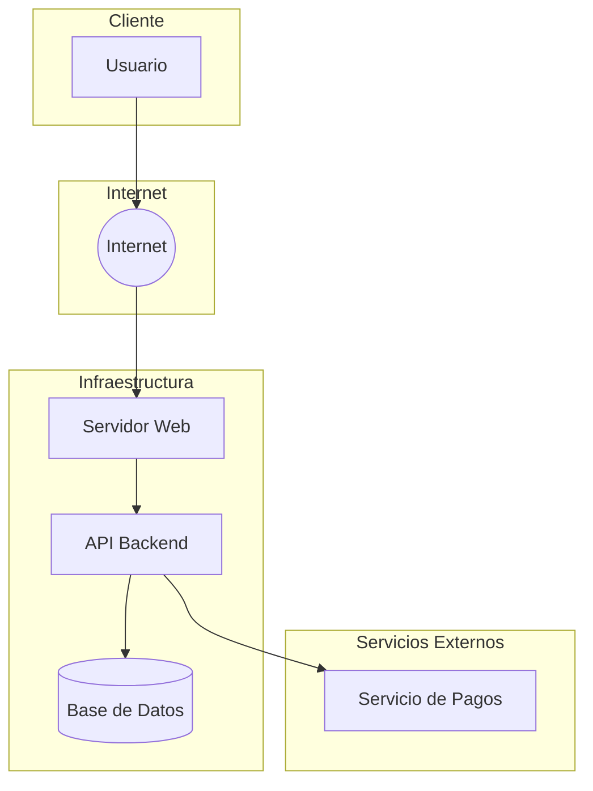

---

## 10. Diagrama de Comunicación

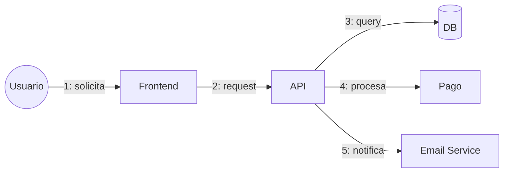

---

## 11. Diagrama de Estructura Compuesta

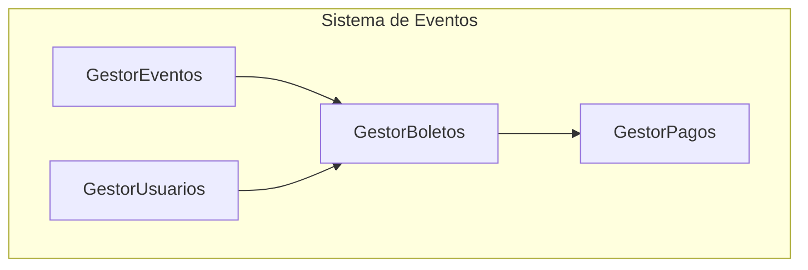
