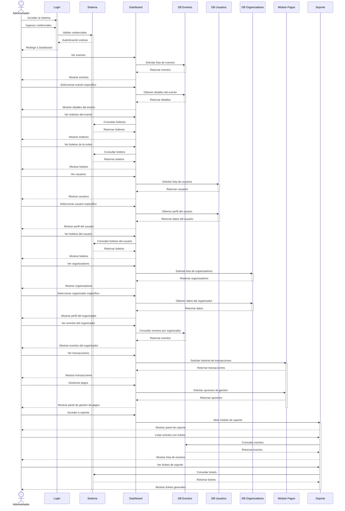
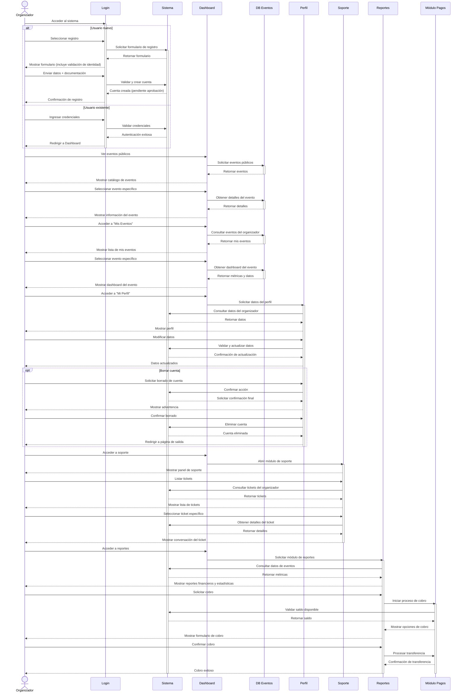
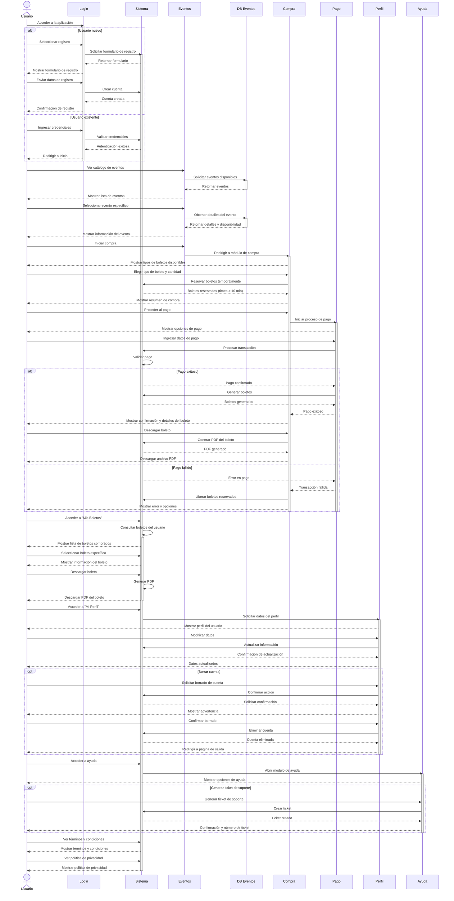
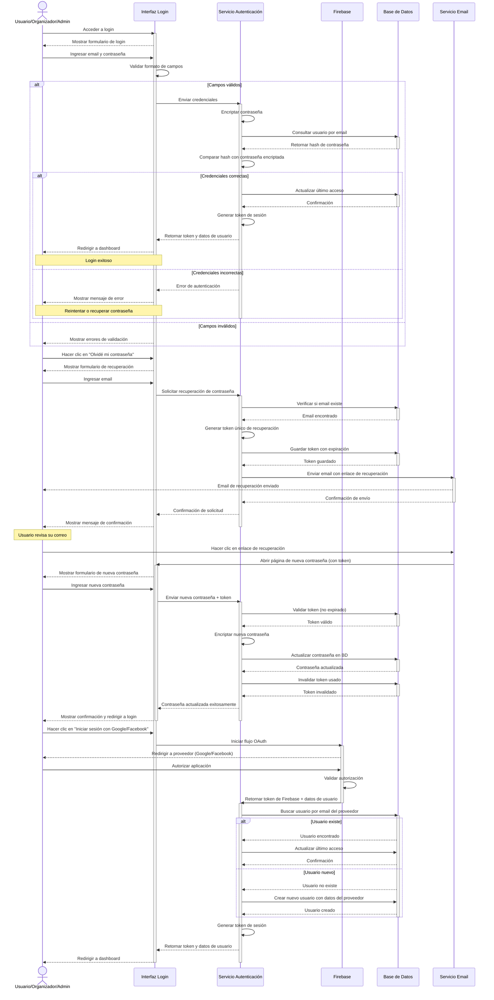

# Diagramas de Secuencia - Sistema de Gestión de Eventos

Este documento contiene los diagramas de secuencia que representan las interacciones temporales entre actores y el sistema para cada tipo de usuario.

## 1. Diagrama de Secuencia - Administrador

## 2. Diagrama de Secuencia - Organizador

## 3. Diagrama de Secuencia - Usuario Normal

## 4. Diagrama de Secuencia - Proceso de Inicio de Sesión (Detallado)

---

## Notas adicionales

- Todos los diagramas incluyen manejo de errores y flujos alternativos donde sea relevante
- Los tiempos de timeout y reservas son configurables según las necesidades del negocio
- La autenticación con Firebase permite integración con Google y Facebook como se especifica en los requerimientos
- Los tokens de recuperación de contraseña tienen un tiempo de expiración para mayor seguridad
- Las transacciones de pago incluyen validaciones y rollback en caso de fallo
