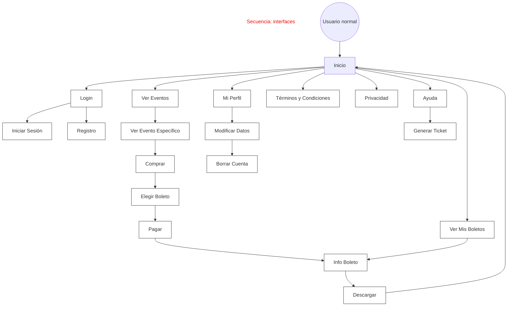
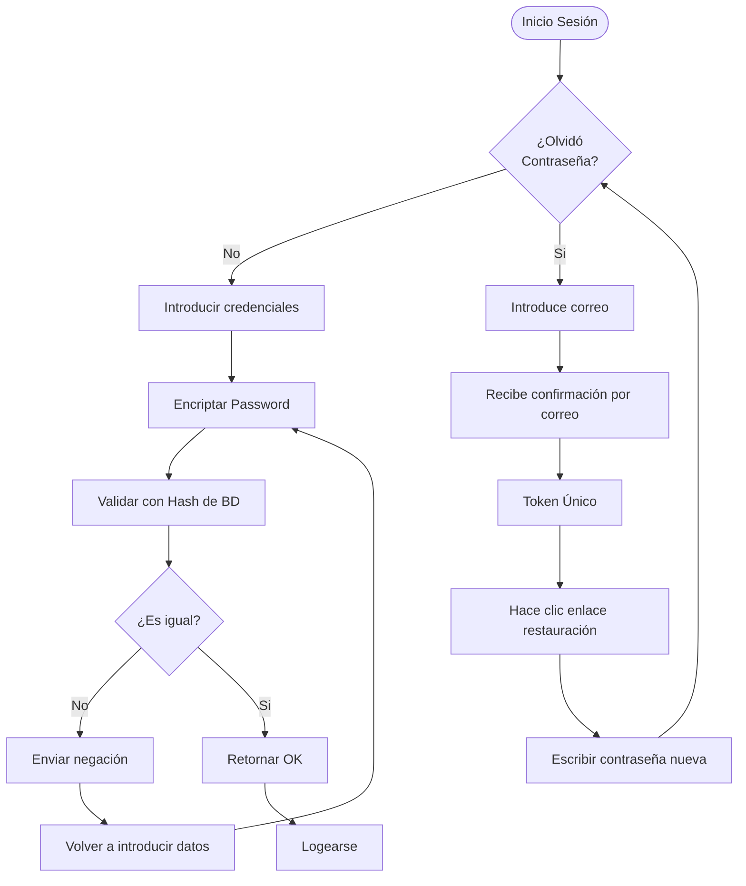

# Requerimientos de cada interfaz

## Flujo de navegación de interfaces

### Flujo de navegación de Administrador

```mermaid
graph TD
    %% Define styles for clarity, mirroring hand-drawn feel
    classDef box fill:#fff,stroke:#333,stroke-width:1px;
    classDef label fill:none,stroke:none;

    %% Elements
    Admin((Administrador))
    Inicio[Login/Inicio]
    LoginB[Login]:::box
    IniciarSesion[Iniciar Sesión]:::box
    VerEventos[Ver Eventos]:::box
    VerEventoEspecifico[Ver Evento Específico]:::box
    VerOrdenesEvento[Ver Ordenes de Evento]:::box
    VerBoletos[Ver Boletos]:::box
    VerUsuarios[Ver Usuarios]:::box
    VerUsuarioEspecifico[Ver Usuario Específico]:::box
    VerOrganizadores[Ver Organizadores]:::box
    VerOrganizadorEspecifico[Ver Organizador Específico]:::box
    EventosOrganizador[Eventos de Organizador]:::box
    Transacciones[Transacciones]:::box
    Dashboard[Dashboard]:::box
    GestionarPagos[Gestionar Pagos]:::box
    Soporte[Soporte]:::box
    ListarEventos[Listar Eventos]:::box
    ListarTickets[Listar Tickets]:::box
    ListarTicketsGeneral[Listar Tickets en General]:::box

    %% Connections
    Admin --> Inicio
    Inicio --> LoginB
    LoginB --> IniciarSesion
    IniciarSesion -.-> LoginB %% Dashed return, inferred

    Inicio --> VerEventos
    VerEventos --> VerEventoEspecifico
    VerEventoEspecifico --> VerOrdenesEvento
    VerOrdenesEvento --> VerBoletos

    Inicio --> VerUsuarios
    VerUsuarios --> VerUsuarioEspecifico
    VerUsuarioEspecifico --> VerBoletos

    Inicio --> VerOrganizadores
    VerOrganizadores --> VerOrganizadorEspecifico
    VerOrganizadorEspecifico --> EventosOrganizador

    Inicio --> Transacciones
    Transacciones --> Dashboard
    Dashboard --> GestionarPagos

    Inicio --> Soporte
    Soporte --> ListarEventos
    Soporte --> ListarTickets
    ListarTickets --> ListarTicketsGeneral
    ListarTicketsGeneral --> Soporte
    ListarEventos --> ListarTickets
```

### Flujo de navegación de Organizador

```mermaid
graph TD
    %% Define styles
    classDef box fill:#fff,stroke:#333,stroke-width:1px;

    %% Elements
    Organizador((Organizador))
    Inicio[Inicio]
    VerEventos[Ver Eventos]:::box
    VerEventoEspecifico[Ver Evento Específico]:::box
    MisEventos[Mis Eventos]:::box
    ListarEventos[Listar Eventos]:::box
    EventoEspecificoDash[Evento Específico<br/>Dashboard]:::box
    MiPerfil[Mi Perfil]:::box
    ModificarDatos[Modificar Datos]:::box
    BorrarCuenta[Borrar Cuenta]:::box
    Soporte[Soporte]:::box
    ListarTickets[Listar Tickets]:::box
    TicketEspecifico[Ticket Específico]:::box
    Reportes[Reportes]:::box
    VerReportes[Ver Reportes]:::box
    Cobrar[Cobrar]:::box
    LoginB[Login]:::box
    IniciarSesion[Iniciar Sesión]:::box
    Registro[Registro<br/>Validación identidad]:::box

    %% Connections
    Organizador --> Inicio
    Inicio --> VerEventos
    VerEventos --> VerEventoEspecifico

    Inicio --> MisEventos
    MisEventos --> ListarEventos
    ListarEventos --> EventoEspecificoDash

    Inicio --> MiPerfil
    MiPerfil --> ModificarDatos
    ModificarDatos --> BorrarCuenta

    Inicio --> Soporte
    Soporte --> ListarTickets
    ListarTickets --> TicketEspecifico

    Inicio --> Reportes
    Reportes --> VerReportes
    VerReportes --> Cobrar
    Cobrar --> Reportes

    Inicio --> LoginB
    LoginB --> IniciarSesion
    LoginB --> Registro
    Registro --> LoginB
    IniciarSesion -.-> Inicio %% Dash for logical navigation return
```

### Flujo de navegación de Usuario normal



## Interfaces Usuario normal

### Interfaz login

Esta interfaz sera igual tanto para usuario, admin, organizador, como para cualquier otro tipo de roles. No es necesario rehacer para otros roles.

Investigar autenticacion con firebase, para tenerlo en cuenta en el diseno de las interfaces. (solo aceptar autenticacion con google o facebook)



**Funciones:**

- `Restaurar contrasena`: Solicitar correo electronico, hipervinculo de terminos y condiciones
- `Login`: Solicitar correo, contrasena, boton de Iniciar sesion, boton de registrarse, hipervinculo de olvido contrasena, hiper vinculo de terminos y condiciones, hipervinculo de privacidad.
- `Registrarse`: (al presionar desplegar lista roles, usuario o organizador | usar como referencia para esto, el registro de google),
  - Solicitar datos(registro usuario):
    - nombre
    - Correo
    - contrasena
    - Nacimiento
    - Numero
    - Direccion
  - Solicitar datos(registro organizador):
    - nombre
    - correo
    - contraseña
    - Nacimiento
    - Numero
    - Direccion
    - RFC
    - Solicitud de confirmacion de identidad(fotografia) -> esta seccion dejarla pendiente, despues comunicare detalle cuando sepa qp.
  - Agregar casilla de acepta terminos y condiciones, junto hipervinculo.\

---

## Login

### Descripción

[Propósito de la interfaz]

### Acceso

- Rol requerido: Público
- Ruta: /login
- Condiciones: Ninguna

### Datos de Entrada

- Correo electrónico: text - obligatorio - formato email
- Contraseña: password - obligatorio - mínimo 8 caracteres

### Funciones Disponibles

- Iniciar sesión: valida credenciales → redirige a dashboard según rol
- Recuperar contraseña: envía email → genera token → permite cambio
- Registrarse: abre formulario registro → según rol elegido
- Login con Google: OAuth → crea/accede cuenta → dashboard
- Login con Facebook: OAuth → crea/accede cuenta → dashboard

### Datos Mostrados

- Logo aplicación
- Título bienvenida
- Links: términos, privacidad

### Validaciones

- [ ] Email debe tener formato válido
- [ ] Contraseña debe tener mínimo 8 caracteres
- [ ] Máximo 3 intentos fallidos antes de bloqueo temporal

### Mensajes

- Error credenciales: "Correo o contraseña incorrectos"
- Error bloqueado: "Demasiados intentos, intenta en 15 minutos"
- Éxito: "Bienvenido de vuelta"

### Navegación

- Dashboard Admin (si rol = admin)
- Dashboard Organizador (si rol = organizador)
- Catálogo Eventos (si rol = usuario)
- Registro Usuario
- Registro Organizador
- Recuperar Contraseña

---

## Registro Usuario

### Descripción

### Acceso

- Rol requerido: publico
- Ruta: /register
- Condiciones: Usuario no registrado.

### Datos de Entrada

- Correo electronico
- Contraseña
- nombre
- Nacimiento
- Numero
- Direccion

### Funciones Disponibles

- Validar datos unicos/correctos
- Registrar usuarios en sistema

### Datos Mostrados

- Logo de apicacion
- Links: terminos y condiciones, privacidad.
- formulario de solicitud de datos.

### Validaciones

- Correo electronico unico en la BD.
- Contraseña cumple con minimo de 8 caracteres.
- marcar casilla de accepto terminos y condiciones.

### Mensajes

- Error: "Este correo electronico ya esta en uso"
- Error: "Minimo 8 caracteres debe tener la Contraseña"
- Exito: "Te has registrado correctamente"

### Navegación

---

## Registro Organizador

### Descripción

### Acceso

- Rol requerido:
- Ruta:
- Condiciones:

### Datos de Entrada

- Nombre
- Correo
- Contraseña
- RFC
- Nacimiento
- Numero
- Validacion de identidad
- Nombre empresa

### Funciones Disponibles

- Registro de Organizador

### Datos Mostrados

- Logo de empresa
- Links: terminos y condiciones, privacidad

### Validaciones

- Validacion de correo unico
- Contrasena cumple con 8 caracteres
- Validacion de RFC
- Validacion de nacimiento coincide con RFC

### Mensajes

Error: Correo ya asociado
Error: Contraseña no tiene 8 caracteres
Error: RFC ya registrado
Error: RFC no coincide con su dueno
Exito: Te has registrado exitosamente

### Navegación

---

## Recuperar Contraseña

### Descripción

Esta interfaz, es para la recuperacion de contraseña de una cuenta asociada a un correo electronico.

### Acceso

- Rol requerido: Admin, Organizador, Usuario
- Ruta: /recovery_password
- Condiciones: Usuario haber introducido su correo electronico de su cuenta

### Datos de Entrada

- Correo electronico

### Funciones Disponibles

- Envio de correo de restauración
- (asincronica), validacion de token de restauración
- restauración de contraseña

### Datos Mostrados

- Logo tipo de empresa
- Links: termicos y condiciones, privacidad

### Validaciones

- Validacion de correo electronico unico
- validacion de token de restauración

### Mensajes

Error: Este correo electronico no tiene una cuenta
Error: La nueva contraseña no puede ser la anterior
Error: La contraseña debe ser de al menos 8 caracteres
Exito: Se ha restaurado tu contraseña

### Navegación

---

## Catálogo de Eventos

### Descripción

### Acceso

- Rol requerido:
- Ruta:
- Condiciones:

### Datos de Entrada

### Funciones Disponibles

### Datos Mostrados

### Validaciones

### Mensajes

### Navegación

---

## Detalle de Evento

### Descripción

### Acceso

- Rol requerido:
- Ruta:
- Condiciones:

### Datos de Entrada

### Funciones Disponibles

### Datos Mostrados

### Validaciones

### Mensajes

### Navegación

---

## Dashboard Usuario

### Descripción

### Acceso

- Rol requerido:
- Ruta:
- Condiciones:

### Datos de Entrada

### Funciones Disponibles

### Datos Mostrados

### Validaciones

### Mensajes

### Navegación

---

## Proceso de Compra

### Descripción

### Acceso

- Rol requerido:
- Ruta:
- Condiciones:

### Datos de Entrada

### Funciones Disponibles

### Datos Mostrados

### Validaciones

### Mensajes

### Navegación

---

## Selección de Boletos

### Descripción

### Acceso

- Rol requerido:
- Ruta:
- Condiciones:

### Datos de Entrada

### Funciones Disponibles

### Datos Mostrados

### Validaciones

### Mensajes

### Navegación

---

## Pago

### Descripción

### Acceso

- Rol requerido:
- Ruta:
- Condiciones:

### Datos de Entrada

### Funciones Disponibles

### Datos Mostrados

### Validaciones

### Mensajes

### Navegación

---

## Mis Boletos

### Descripción

### Acceso

- Rol requerido:
- Ruta:
- Condiciones:

### Datos de Entrada

### Funciones Disponibles

### Datos Mostrados

### Validaciones

### Mensajes

### Navegación

---

## Descarga Boleto PDF

### Descripción

### Acceso

- Rol requerido:
- Ruta:
- Condiciones:

### Datos de Entrada

### Funciones Disponibles

### Datos Mostrados

### Validaciones

### Mensajes

### Navegación

---

## Perfil Usuario

### Descripción

### Acceso

- Rol requerido:
- Ruta:
- Condiciones:

### Datos de Entrada

### Funciones Disponibles

### Datos Mostrados

### Validaciones

### Mensajes

### Navegación

---

## Ayuda/Soporte Usuario

### Descripción

### Acceso

- Rol requerido:
- Ruta:
- Condiciones:

### Datos de Entrada

### Funciones Disponibles

### Datos Mostrados

### Validaciones

### Mensajes

### Navegación

---

## Crear Ticket Soporte

### Descripción

### Acceso

- Rol requerido:
- Ruta:
- Condiciones:

### Datos de Entrada

### Funciones Disponibles

### Datos Mostrados

### Validaciones

### Mensajes

### Navegación

---

## Dashboard Organizador

### Descripción

### Acceso

- Rol requerido:
- Ruta:
- Condiciones:

### Datos de Entrada

### Funciones Disponibles

### Datos Mostrados

### Validaciones

### Mensajes

### Navegación

---

## Mis Eventos

### Descripción

### Acceso

- Rol requerido:
- Ruta:
- Condiciones:

### Datos de Entrada

### Funciones Disponibles

### Datos Mostrados

### Validaciones

### Mensajes

### Navegación

---

## Detalle Evento Organizador

### Descripción

### Acceso

- Rol requerido:
- Ruta:
- Condiciones:

### Datos de Entrada

### Funciones Disponibles

### Datos Mostrados

### Validaciones

### Mensajes

### Navegación

---

## Crear/Editar Evento

### Descripción

### Acceso

- Rol requerido:
- Ruta:
- Condiciones:

### Datos de Entrada

### Funciones Disponibles

### Datos Mostrados

### Validaciones

### Mensajes

### Navegación

---

## Dashboard por Evento

### Descripción

### Acceso

- Rol requerido:
- Ruta:
- Condiciones:

### Datos de Entrada

### Funciones Disponibles

### Datos Mostrados

### Validaciones

### Mensajes

### Navegación

---

## Reportes Financieros

### Descripción

### Acceso

- Rol requerido:
- Ruta:
- Condiciones:

### Datos de Entrada

### Funciones Disponibles

### Datos Mostrados

### Validaciones

### Mensajes

### Navegación

---

## Perfil Organizador

### Descripción

### Acceso

- Rol requerido:
- Ruta:
- Condiciones:

### Datos de Entrada

### Funciones Disponibles

### Datos Mostrados

### Validaciones

### Mensajes

### Navegación

---

## Soporte Organizador

### Descripción

### Acceso

- Rol requerido:
- Ruta:
- Condiciones:

### Datos de Entrada

### Funciones Disponibles

### Datos Mostrados

### Validaciones

### Mensajes

### Navegación

---

## Proceso de Cobro

### Descripción

### Acceso

- Rol requerido:
- Ruta:
- Condiciones:

### Datos de Entrada

### Funciones Disponibles

### Datos Mostrados

### Validaciones

### Mensajes

### Navegación

---

## Dashboard Admin

### Descripción

### Acceso

- Rol requerido:
- Ruta:
- Condiciones:

### Datos de Entrada

### Funciones Disponibles

### Datos Mostrados

### Validaciones

### Mensajes

### Navegación

---

## Gestión de Eventos

### Descripción

### Acceso

- Rol requerido:
- Ruta:
- Condiciones:

### Datos de Entrada

### Funciones Disponibles

### Datos Mostrados

### Validaciones

### Mensajes

### Navegación

---

## Detalle Evento Admin

### Descripción

### Acceso

- Rol requerido:
- Ruta:
- Condiciones:

### Datos de Entrada

### Funciones Disponibles

### Datos Mostrados

### Validaciones

### Mensajes

### Navegación

---

## Gestión de Usuarios

### Descripción

### Acceso

- Rol requerido:
- Ruta:
- Condiciones:

### Datos de Entrada

### Funciones Disponibles

### Datos Mostrados

### Validaciones

### Mensajes

### Navegación

---

## Perfil de Usuario (vista admin)

### Descripción

### Acceso

- Rol requerido:
- Ruta:
- Condiciones:

### Datos de Entrada

### Funciones Disponibles

### Datos Mostrados

### Validaciones

### Mensajes

### Navegación

---

## Boletos de Usuario (vista admin)

### Descripción

### Acceso

- Rol requerido:
- Ruta:
- Condiciones:

### Datos de Entrada

### Funciones Disponibles

### Datos Mostrados

### Validaciones

### Mensajes

### Navegación

---

## Gestión de Organizadores

### Descripción

### Acceso

- Rol requerido:
- Ruta:
- Condiciones:

### Datos de Entrada

### Funciones Disponibles

### Datos Mostrados

### Validaciones

### Mensajes

### Navegación

---

## Perfil Organizador (vista admin)

### Descripción

### Acceso

- Rol requerido:
- Ruta:
- Condiciones:

### Datos de Entrada

### Funciones Disponibles

### Datos Mostrados

### Validaciones

### Mensajes

### Navegación

---

## Eventos de Organizador (vista admin)

### Descripción

### Acceso

- Rol requerido:
- Ruta:
- Condiciones:

### Datos de Entrada

### Funciones Disponibles

### Datos Mostrados

### Validaciones

### Mensajes

### Navegación

---

## Transacciones y Pagos

### Descripción

### Acceso

- Rol requerido:
- Ruta:
- Condiciones:

### Datos de Entrada

### Funciones Disponibles

### Datos Mostrados

### Validaciones

### Mensajes

### Navegación

---

## Soporte Admin

### Descripción

### Acceso

- Rol requerido:
- Ruta:
- Condiciones:

### Datos de Entrada

### Funciones Disponibles

### Datos Mostrados

### Validaciones

### Mensajes

### Navegación

---
