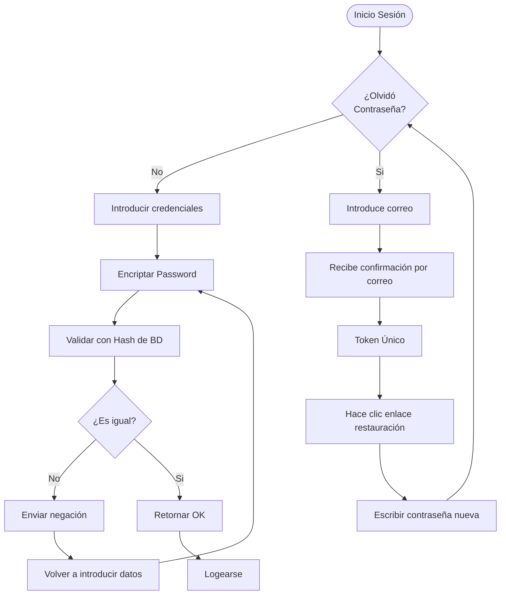

# Requerimientos de cada interfaz

## Interfaces Usuario normal

### Interfaz login:

Esta interfaz sera igual tanto para usuario, admin, organizador, como para cualquier otro tipo de roles. No es necesario rehacer para otros roles.

Investigar autenticacion con firebase, para tenerlo en cuenta en el diseno de las interfaces. (solo aceptar autenticacion con google o facebook)

**Funciones:**

- `Restaurar contrasena`: Solicitar correo electronico, hipervinculo de terminos y condiciones
- `Login`: Solicitar correo, contrasena, boton de Iniciar sesion, boton de registrarse, hipervinculo de olvido contrasena, hiper vinculo de terminos y condiciones, hipervinculo de privacidad.
- `Registrarse`: (al presionar desplegar lista roles, usuario o organizador | usar como referencia para esto, el registro de google),
  - Solicitar datos(registro usuario):
    - nombre
    - Correo
    - contrasena
    - Nacimiento
    - Numero
    - Direccion
  - Solicitar datos(registro organizador):
    - nombre
    - correo
    - contraseña
    - Nacimiento
    - Numero
    - Direccion
    - RFC
    - Solicitud de confirmacion de identidad(fotografia) -> esta seccion dejarla pendiente, despues comunicare detalle cuando sepa qp.
  - Agregar casilla de acepta terminos y condiciones, junto hipervinculo.
